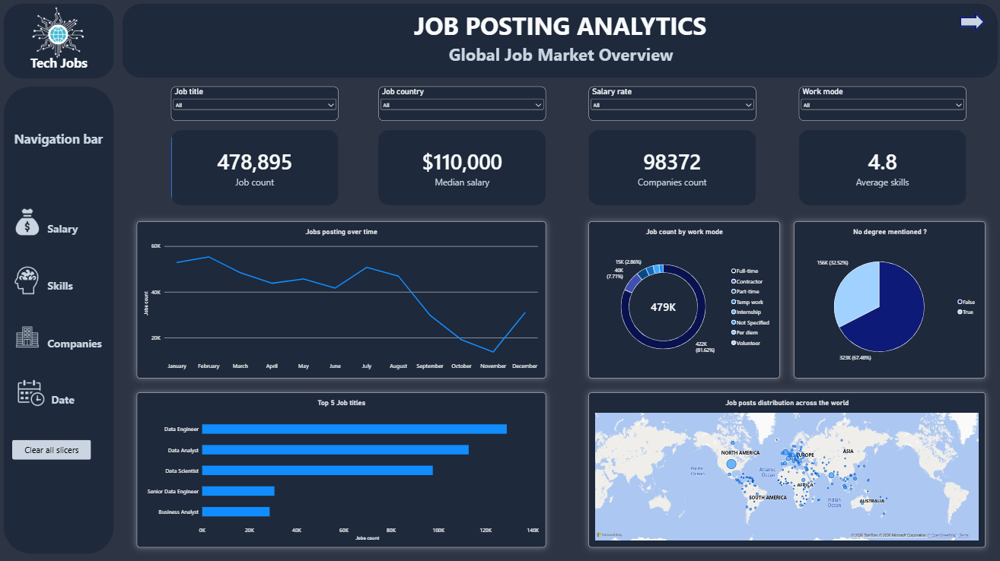
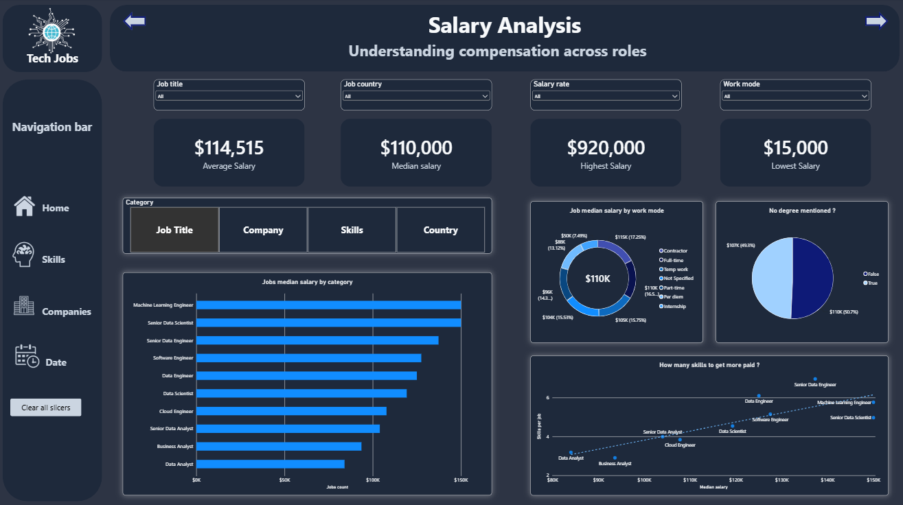
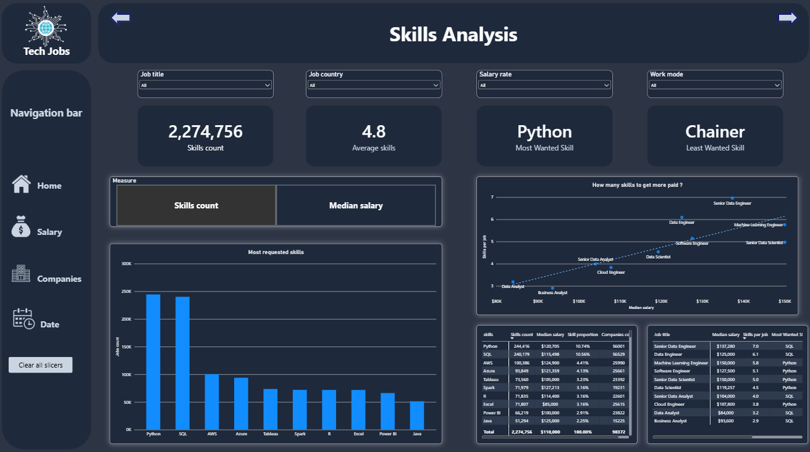
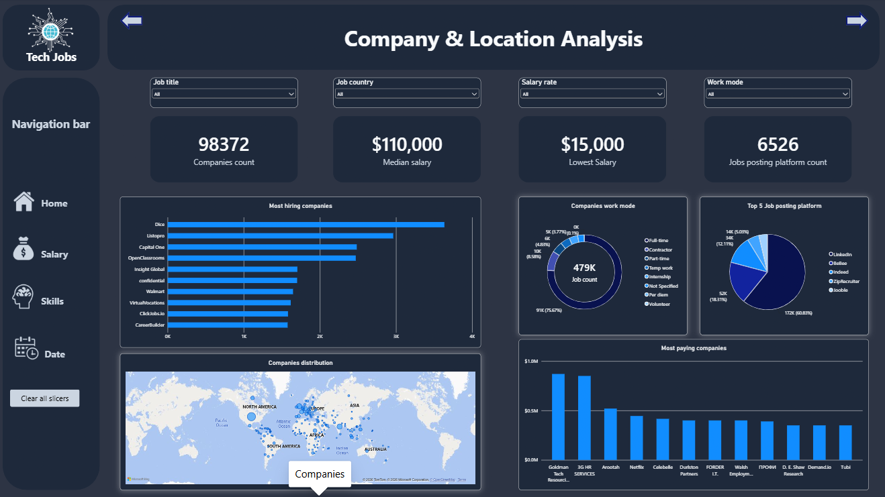
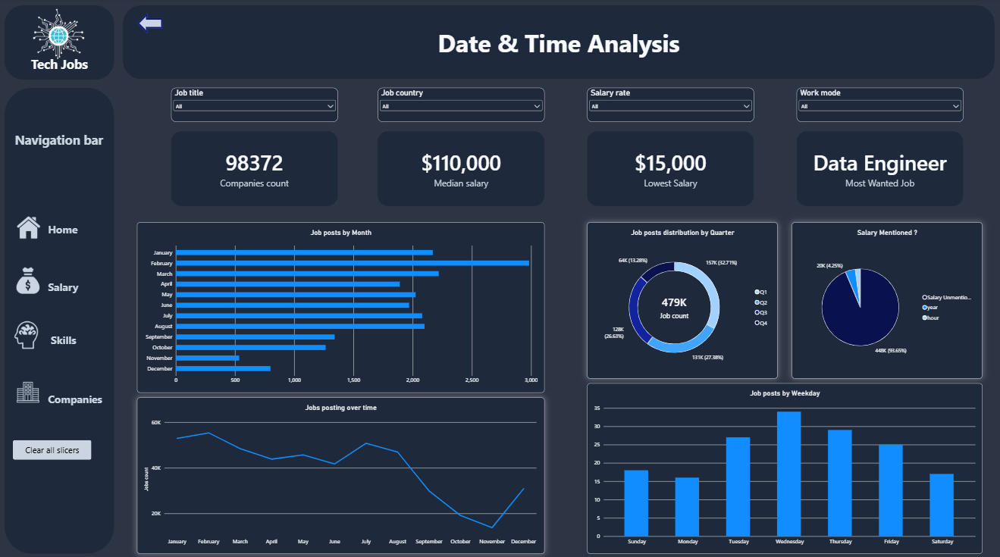
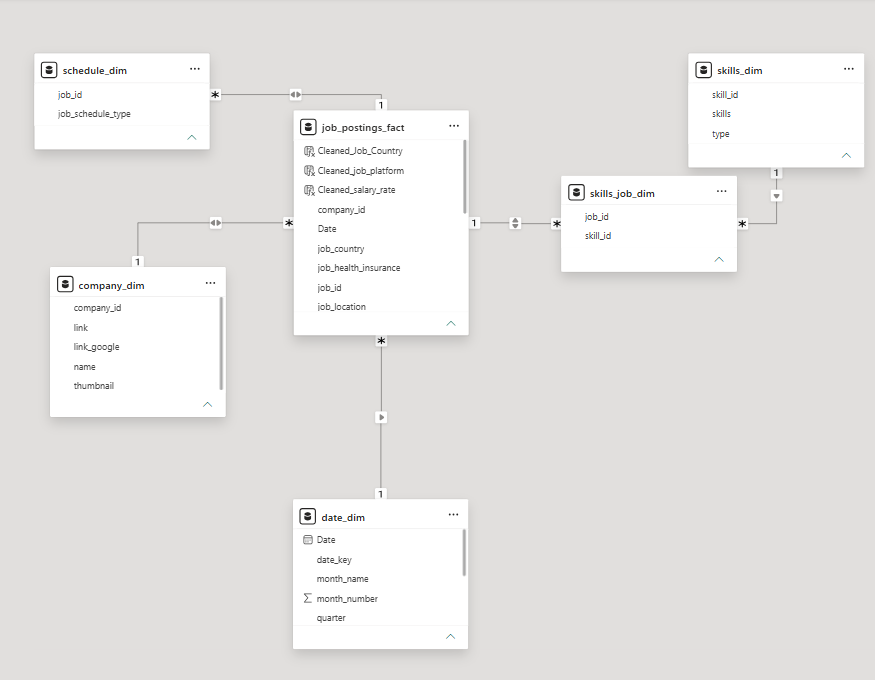

# 📊 Power BI Job Posting Analytics

An interactive **Power BI dashboard for analyzing the global technology job market**, covering job demand, salaries, skills, companies, locations, work modes, and posting trends.

The project transforms raw job-posting data into a structured analytical model and an interactive five-page Power BI report designed to answer practical questions about the technology job market.

---

## 📌 Project Overview

The **Job Posting Analytics** project uses Microsoft Power BI to explore a large collection of technology job postings and identify patterns across:

* Job demand
* Salary levels
* Required skills
* Companies
* Job-posting platforms
* Locations
* Work modes
* Degree requirements
* Posting dates and time trends

The project focuses on the complete analytical workflow:

**Data Cleaning → Data Transformation → Data Modeling → DAX → Visualization → Business Analysis**

The dashboard provides dedicated analytical pages for the **global job market, salaries, skills, companies and locations, and date/time trends**.

---

# 🎯 Project Objectives

The main objectives of this project are to:

* Analyze the global technology job market.
* Identify the most frequently requested job titles.
* Analyze salary distributions across different roles.
* Identify the most requested technical skills.
* Examine the relationship between skills and salary.
* Analyze companies and their hiring activity.
* Explore job-posting platforms.
* Analyze job opportunities geographically.
* Compare work modes such as full-time, contract, part-time, and temporary work.
* Analyze job-posting trends over time.
* Examine salary availability and degree requirements.
* Build an interactive Power BI dashboard for exploring the data.

---

# 🧹 Data Cleaning & Transformation

The raw job-posting data was prepared in Power BI before building the analytical model.

## 1. Creating Dimension Tables

Two supporting dimension tables were created during the preparation stage:

### Date Dimension

A dedicated `date_dim` table was created to support time-based analysis.

The table contains attributes such as:

* Date
* Date Key
* Month Name
* Month Number
* Quarter

This allows job postings to be analyzed by month, quarter, and other time-based categories.

### Schedule Dimension

A `schedule_dim` table was created to organize job schedule/work-mode information.

Blank schedule values were replaced with:

```text
Not Specified
```

This ensures that missing schedule information remains visible in the analysis instead of being excluded from visuals.

---

## 2. Handling Missing Values

Several columns contained blank values. Instead of removing these records, meaningful fallback categories were created.

### Job Country

If `job_country` was blank, `search_location` was used to create:

```text
Cleaned_Job_Country
```

This provides a fallback location for job postings where the original country field was unavailable.

### Salary Rate

If `salary_rate` was blank, the value:

```text
Unmentioned Salary
```

was assigned to:

```text
Cleaned_salary_rate
```

This allows salary availability to be analyzed explicitly.

### Job Platform

If `job_via` was blank, it was replaced with:

```text
Unknown
```

forming:

```text
Cleaned_job_platform
```

### Schedule

Blank schedule values were categorized as:

```text
Not Specified
```

---

## 🧩 Data Model

The Power BI model was designed using separate fact and dimension tables, with a bridge table connecting jobs and skills.

### Main Tables

#### `job_postings_fact`

The central job-posting table containing job-level information such as:

* Job ID
* Job title
* Job country
* Job location
* Salary information
* Work mode
* Job platform
* Company ID
* Date
* Other job-related attributes

#### `company_dim`

Contains company-level information including:

* `company_id`
* Company name
* Google link
* Thumbnail

#### `schedule_dim`

Contains standardized job schedule/work-mode information:

* `job_id`
* `job_schedule_type`

#### `date_dim`

Provides time-related attributes:

* Date
* Date Key
* Month Name
* Month Number
* Quarter

#### `skills_dim`

Contains the skill master list:

* `skill_id`
* Skill
* Skill Type

#### `skills_job_dim`

Acts as a bridge table between jobs and skills:

* `job_id`
* `skill_id`

This structure allows a single job posting to be associated with multiple skills.

### Model Structure

```text
                    company_dim
                         │
                         │
                         ▼
schedule_dim ───► job_postings_fact ◄─── date_dim
                         │
                         │
                         ▼
                  skills_job_dim
                         │
                         ▼
                    skills_dim
```

The model follows Power BI dimensional-modeling principles, where dimension tables provide filtering and grouping context while fact tables contain the detailed observations used for aggregation. The `skills_job_dim` table serves as a bridge for the job-to-skill relationship.

---

# 🧮 DAX & Measures

All DAX measures created for the dashboard were organized into a dedicated **measures table**.

Keeping the measures together provides a cleaner model and makes the report easier to maintain.

The measures support calculations related to:

* Job counts
* Company counts
* Salary analysis
* Median salary
* Average salary
* Minimum salary
* Maximum salary
* Skills
* Average skills
* Job titles
* Work modes
* Job platforms
* Time analysis
* Salary availability
* Other dashboard KPIs

Power BI measures are evaluated dynamically according to the filter context applied by report visuals and slicers.

---

# 📊 Dashboard Structure

The report contains **five analytical pages**.

---

# 1. 🌍 Global Job Market Overview

### Page Title

**Job Posting Analytics**

### Subtitle

**Global Job Market Overview**

This page provides a high-level overview of the technology job market.

### KPI Cards

* **Job Count:** 478,895
* **Median Salary:** $110,000
* **Companies Count:** 98,372
* **Average Skills:** 4.8

### Visualizations

#### Jobs Posting Over Time

A line chart showing how job-posting volume changes throughout the year.

#### Job Count by Work Mode

A donut chart showing the distribution of jobs across different work modes.

#### Degree Requirement

A donut chart showing whether a degree requirement was mentioned in job postings.

#### Top 5 Job Titles

A horizontal bar chart showing the five most frequently posted job titles.

#### Job Posts Distribution Across the World

A geographic map showing the global distribution of job postings.

### Filters

The page includes interactive slicers for:

* Job Title
* Job Country
* Salary Rate
* Work Mode

---

# 2. 💰 Salary Analysis

### Page Title

**Salary Analysis**

### Subtitle

**Understanding compensation across roles**

This page focuses on salary levels and the relationship between compensation, job roles, and skills.

### KPI Cards

* **Average Salary:** $114,515
* **Median Salary:** $110,000
* **Highest Salary:** $920,000
* **Lowest Salary:** $15,000

### Visualizations

#### Jobs Median Salary by Category

A horizontal bar chart comparing median salary across different job titles.

#### Job Median Salary by Work Mode

A donut chart showing median salary across different work modes.

#### Degree Requirement

A visualization showing whether degree requirements were mentioned in job postings.

#### Skills vs. Salary

A scatter chart exploring the relationship between:

* Median salary
* Number of skills required per job

#### Category Selector

An interactive selector allows the analysis to be viewed by different categories, including:

* Job Title
* Company
* Skills
* Country

This provides multiple ways to investigate salary patterns.

---

# 3. 🧠 Skills Analysis

### Page Title

**Skills Analysis**

This page focuses on the skills requested across technology job postings.

### KPI Cards

* **Skills Count:** 2,274,756
* **Average Skills:** 4.8
* **Most Wanted Skill:** Python
* **Least Wanted Skill:** Chainer

### Visualizations

#### Most Requested Skills

A bar chart showing the most frequently requested skills.

The dashboard currently highlights skills such as:

* Python
* SQL
* AWS
* Azure
* Tableau
* Spark
* R
* Excel
* Power BI
* Java

#### Skills vs. Salary

A scatter chart exploring the relationship between:

* Median salary
* Number of skills required

#### Skills Detail Table

Provides detailed information including:

* Skill
* Skills Count
* Median Salary
* Skill Proportion
* Companies Count

#### Job Title Skills Table

Provides information including:

* Job Title
* Median Salary
* Skills per Job
* Most Wanted Skill

### Interactive Analysis

Users can switch between different analytical measures such as:

* Skills Count
* Median Salary

This allows the same visual space to support different business questions.

---

# 4. 🏢 Company & Location Analysis

### Page Title

**Company & Location Analysis**

This page examines hiring companies, company locations, job platforms, and work modes.

### KPI Cards

* **Companies Count:** 98,372
* **Median Salary:** $110,000
* **Lowest Salary:** $15,000
* **Job Posting Platform Count:** 6,526

### Visualizations

#### Most Hiring Companies

A horizontal bar chart identifying companies with the highest number of job postings.

#### Companies Work Mode

A donut chart showing the distribution of company job postings across different work modes.

#### Top 5 Job Posting Platforms

A donut chart showing the most frequently used job-posting platforms.

#### Companies Distribution

A world map showing the geographic distribution of companies/job opportunities.

#### Most Paying Companies

A bar chart comparing companies according to salary levels.

### Analysis Areas

This page helps investigate questions such as:

* Which companies are posting the most jobs?
* Which companies offer higher salaries?
* Where are companies geographically distributed?
* Which platforms are most commonly used for job postings?
* How are jobs distributed by work mode?

---

# 5. 📅 Date & Time Analysis

### Page Title

**Date & Time Analysis**

This page focuses on temporal patterns in job postings.

### KPI Cards

* **Companies Count:** 98,372
* **Median Salary:** $110,000
* **Lowest Salary:** $15,000
* **Most Wanted Job:** Data Engineer

### Visualizations

#### Job Posts by Month

A bar chart comparing job-posting volume across the months of the year.

#### Job Posts by Quarter

A donut chart showing the distribution of job postings across:

* Q1
* Q2
* Q3
* Q4

#### Salary Mentioned?

A donut chart showing whether salary information was provided in the job posting.

Categories include salary information such as:

* Salary Unmentioned
* Year
* Hour

#### Job Posts Over Time

A line chart showing job-posting volume throughout the year.

#### Job Posts by Weekday

A bar chart comparing job-posting activity across the days of the week.

---

# 🎛️ Interactive Features

The dashboard was designed to allow users to interactively explore the job market.

### Global Filters

The main pages include slicers for:

* Job Title
* Job Country
* Salary Rate
* Work Mode

### Navigation

A navigation sidebar allows users to move between the major analytical areas:

* Home
* Salary
* Skills
* Companies
* Date

### Clear All Slicers

A dedicated button allows users to reset the applied filters and return to the default dashboard view.

### Page Navigation

Navigation arrows are included to move between report pages.

---

# 🔎 Business Questions

The dashboard was designed to answer practical questions such as:

### Job Market

* How many jobs are available?
* Which job titles are most frequently posted?
* How are jobs distributed globally?
* Which work modes are most common?

### Salary

* What is the average salary?
* What is the median salary?
* What are the highest and lowest salaries?
* How does salary differ across job titles?
* How does salary vary by work mode?
* Is there a relationship between salary and the number of required skills?

### Skills

* Which skills are most requested?
* Which skills are least requested?
* How many skills does the average job require?
* Which skills are associated with higher-paying roles?
* Which skills are most common across job titles?

### Companies

* Which companies are hiring the most?
* Which companies offer higher salaries?
* How many companies are represented?
* Which job platforms are used most frequently?
* Where are companies and job opportunities concentrated?

### Time

* How does job-posting volume change throughout the year?
* Which months have the highest posting activity?
* Which quarter has the highest number of postings?
* Which weekdays have the highest posting activity?
* How frequently is salary information provided?

---

# 📈 Key Analytical Areas

The project covers several major areas of data analysis:

### 1. Descriptive Analysis

Understanding the overall structure and distribution of the technology job market.

### 2. Salary Analysis

Examining compensation across:

* Job titles
* Companies
* Work modes
* Skills

### 3. Skills Analysis

Identifying demand for technical skills and examining their relationship with salary.

### 4. Company Analysis

Understanding hiring activity and company-level job-posting patterns.

### 5. Geographic Analysis

Exploring the global distribution of technology job opportunities.

### 6. Time-Series Analysis

Analyzing job-posting activity by:

* Month
* Quarter
* Weekday
* Overall posting timeline

---

# 🛠️ Tools & Technologies

### Power BI

* Power BI Desktop
* Power Query
* DAX
* Data Modeling
* Interactive Visualizations
* Slicers
* Bookmarks / Navigation
* Maps
* KPI Cards

### Data Analysis Concepts

* Data Cleaning
* Missing Value Handling
* Dimensional Modeling
* Fact & Dimension Tables
* Bridge Tables
* KPI Development
* Aggregation
* Salary Analysis
* Time-Series Analysis
* Geographic Analysis
* Skill Analysis

---

# 💡 Skills Demonstrated

This project demonstrates practical experience with:

* Microsoft Power BI
* Power Query
* DAX
* Data Cleaning
* Data Transformation
* Data Modeling
* Dimensional Modeling
* Fact & Dimension Design
* Bridge Tables
* KPI Development
* Data Visualization
* Dashboard Design
* Interactive Reporting
* Salary Analysis
* Skills Analysis
* Company Analysis
* Geographic Analysis
* Time-Based Analysis
* Business Intelligence

---

# 🧱 Data Model Overview

The model consists of:

| Table               | Purpose                                      |
| ------------------- | -------------------------------------------- |
| `job_postings_fact` | Central table containing job-posting records |
| `company_dim`       | Company information                          |
| `schedule_dim`      | Job schedule/work-mode information           |
| `date_dim`          | Date and time attributes                     |
| `skills_dim`        | Skill master data                            |
| `skills_job_dim`    | Bridge between jobs and skills               |
| Measures Table      | Centralized DAX measures                     |

The model separates descriptive dimensions from the central job-posting data and uses a bridge table to represent the many-to-many relationship between jobs and skills.

This approach aligns with Power BI modeling guidance, where dimensions are used for filtering/grouping and fact tables support aggregation.

---

# 🚀 How to Use

1. Download or clone the repository.
2. Open the `.pbix` file using **Power BI Desktop**.
3. Review the data model and relationships.
4. Navigate through the dashboard pages.
5. Use the slicers to filter:

   * Job title
   * Country
   * Salary rate
   * Work mode
6. Use the navigation buttons to explore:

   * Global Job Market
   * Salary Analysis
   * Skills Analysis
   * Company & Location Analysis
   * Date & Time Analysis
7. Use **Clear All Slicers** to reset the current filters.

---

# 📊 Dashboard Preview

### Global Job Market Overview



### Salary Analysis



### Skills Analysis



### Company & Location Analysis



### Date & Time Analysis



### Data Model



---

# 🎯 Project Takeaway

This project demonstrates an end-to-end **Power BI data analytics workflow**, starting from raw job-posting data and progressing through data cleaning, transformation, dimensional modeling, DAX measure development, and interactive dashboard design.

The final dashboard provides multiple perspectives on the technology job market, allowing users to investigate **job demand, salaries, skills, companies, locations, work modes, and posting trends** through a single interactive analytical solution.

The project also demonstrates how a well-structured data model can support multiple analytical perspectives within one Power BI report.

---

## 👨‍💻 Author

**Osama**

Data Analyst | SQL | Power BI | Excel | Python

---

## ⭐ If you find this project useful

Feel free to explore the repository and share your feedback or suggestions for additional analyses that could be added to the dashboard.
